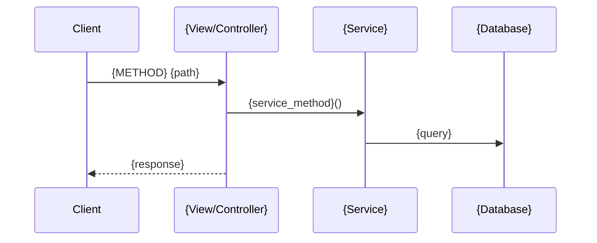

# Output Format Reference

## Directory Structure

```
.speckit-prompts/
├── feature-{NNN}-{kebab-case-name}/
│   ├── 01_specify.md
│   ├── 02_plan.md
│   ├── 03_tasks.md
│   └── 04_implement.md
```

## Folder Naming Convention

- Format: `feature-{NNN}-{kebab-case-name}`
- `{NNN}`: 3-digit zero-padded number (001, 002, ...)
- `{kebab-case-name}`: feature name converted to kebab-case
- Examples:
  - `feature-001-user-authentication`
  - `feature-002-markdown-rendering`
  - `feature-003-api-endpoints`

## 01_specify.md Template

```markdown
/speckit.specify {Feature Name}: {one-line description}

## Purpose (Why)
{2-3 sentences}

## Users (Who)
- {Persona}: {goal}

## Core Features (What)
1. {Feature 1}
2. {Feature 2}
...

## User Scenarios

### Happy Path

{1-2 sentence explanation of the user workflow}

```mermaid
flowchart TD
    A[{user action}] --> B[{next step}]
    B --> C{"{decision}"}
    C -->|Yes| D[{success outcome}]
    C -->|No| E[{error handling}]
```

1. {step}

### Error: {error name}
1. {step}

## Success Criteria
- {measurable criterion}

## Constraints
- {constraint}

## Out of Scope
- {exclusion}

What questions do you have?
```

## 02_plan.md Template

```markdown
/speckit.plan

Tech Stack:
- {language + version}
- {framework + version}

Architecture:

{1-2 sentence explanation of the architecture}

```mermaid
graph TB
    subgraph "{Layer Name}"
        A[{Component}] --> B[{Component}]
    end
```

API Endpoints:
- `{METHOD} {path}` — {description}

API Sequence:

{1-2 sentence explanation of the API call flow}



Data Model:

{1-2 sentence explanation of the data model}

```mermaid
erDiagram
    {Entity1} ||--o{ {Entity2} : {relationship}
    {Entity1} {
        int id PK
        string name
    }
```

Existing Code Reference:
- {file path}: {pattern}

Test Strategy:
- {framework + scope}

Explicit Exclusions:
- {exclusion}
```

## 03_tasks.md Template

```markdown
/speckit.tasks

Task Classification:
- Each task = 1 git commit
- [MODIFY] existing file, [NEW] new file, [TEST] test

Phase 1 (Foundation):
  Task 1 [{tag}]: {file} — {description}
  Task 2 [{tag}]: {file} — {description}

Phase 2 (Integration):
  Task 3 [{tag}]: {file} — {description}

Phase 3 (Testing):
  Task 4 [{tag}]: {description}

Dependencies:
- {dependency info}
```

## 04_implement.md Template

```markdown
/speckit.implement --tasks 1-{N}

Implementation Rules:
- Run tests after each task
- Stop on test failure
- Commit per task: "feat: [Task N] {description}"

Code Style:
- {formatter + rules}

Failure Handling:
- Test failure → stop and report
- Regression → rollback and report
```
