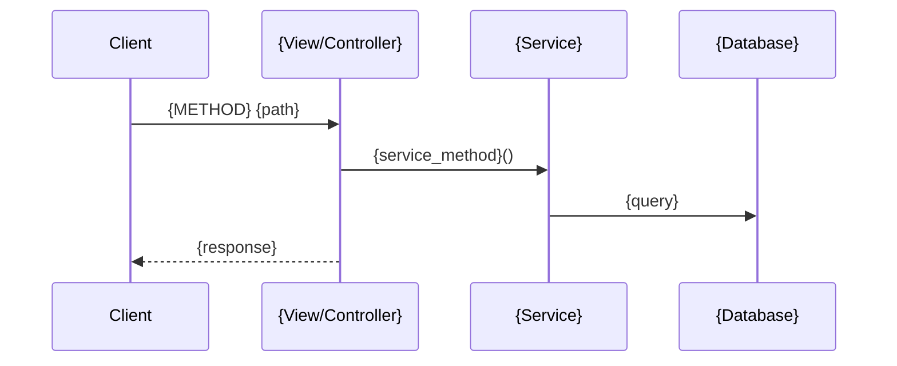

# Output Format Reference

## Directory Structure

```
<project-root>/
├── .speckit-prompts/
│   └── {prd-name}/
│       └── {NNN}-{kebab-case-name}/
│           ├── 01_specify.md
│           ├── 02_clarify.md
│           ├── 03_plan.md
│           ├── 04_checklist.md
│           ├── 05_tasks.md
│           ├── 06_analyze.md
│           ├── 07_implement.md
│           ├── 08_converge.md
│           └── 09_commit.md
└── utilities/
    └── speckit_pipeline.sh   # headless runner (copied from the skill's assets/, chmod +x)
```

## Folder Naming Convention

- Format: `{prd-name}/{NNN}-{kebab-case-name}` — all per-issue folders live under a single parent named after the PRD
- `{prd-name}`: short kebab-case project name derived from the PRD title/product name (2-4 words, strip generic words like "PRD"), e.g. PRD titled "일본어 학습 튜터 챗봇" → `japanese-tutor`
- `{NNN}`: source issue number zero-padded to 3 digits (`00` → `000`, `08` → `008`)
- `{kebab-case-name}`: issue filename slug with the number prefix removed
- Examples (issue file → folder, PRD → `japanese-tutor`):
  - `00-env-compat-gate.md` → `japanese-tutor/000-env-compat-gate/`
  - `01-sync-chat-http.md` → `japanese-tutor/001-sync-chat-http/`
  - `03-ws-streaming-thin-graph.md` → `japanese-tutor/003-ws-streaming-thin-graph/`

## Stage File Order

Filenames encode the sequential run order — `01 → 09`:

| # | File | Command | Kind |
|---|------|---------|------|
| 1 | `01_specify.md` | `/speckit.specify` | per-feature content |
| 2 | `02_clarify.md` | `/speckit.clarify` | fixed auto-accept |
| 3 | `03_plan.md` | `/speckit.plan` | per-feature content |
| 4 | `04_checklist.md` | `/speckit.checklist` | fixed auto-accept |
| 5 | `05_tasks.md` | `/speckit.tasks` | fixed command-only |
| 6 | `06_analyze.md` | `/speckit.analyze` | fixed auto-accept |
| 7 | `07_implement.md` | `/speckit.implement` | per-feature rules |
| 8 | `08_converge.md` | `/speckit.converge` | fixed auto-accept loop |
| 9 | `09_commit.md` | `/sc:git commit` | fixed |

## 01_specify.md Template

```markdown
/speckit.specify {Feature Name}: {one-line description}

## Purpose (Why)
{2-3 sentences}

## User Stories (prioritized, official spec-template format)

### US1 - {title} (Priority: P1)

{plain-language user journey}

**Independent Test**: {how this story is verified on its own}

**Acceptance Scenarios**:

1. **Given** {initial state}, **When** {action}, **Then** {expected outcome}

### US2 - {title} (Priority: P2)

{plain-language user journey}

**Independent Test**: {how this story is verified on its own}

**Acceptance Scenarios**:

1. **Given** {initial state}, **When** {action}, **Then** {expected outcome}

## User Workflow

{1-2 sentence explanation of the user workflow}

```mermaid
flowchart TD
    A[{user action}] --> B[{next step}]
    B --> C{"{decision}"}
    C -->|Yes| D[{success outcome}]
    C -->|No| E[{error handling}]
```

## Edge Cases

- What happens when {boundary condition}?
- How does the system handle {error scenario}?

## Functional Requirements

- **FR-001**: System MUST {specific capability}
- **FR-002**: System MUST {capability} [NEEDS CLARIFICATION: {open question}]

## Success Criteria

- **SC-001**: {measurable, technology-agnostic metric}

## Constraints
- {constraint}

## Out of Scope
- {exclusion}
```

## 02_clarify.md Template

Fixed prompt — no per-feature customization.

```markdown
/speckit.clarify auto-accept all recommended options

Resolve spec ambiguities non-interactively before planning.
- Scan the spec across the official 10-category ambiguity taxonomy.
- Ask up to 5 clarification questions, one at a time.
- For each, automatically select the recommended/suggested option — do not pause for user input.
- Integrate the accepted answers into the spec's ## Clarifications section.
```

## 03_plan.md Template

```markdown
/speckit.plan

Tech Stack:
- {language + version}
- {framework + version}

Architecture:

{1-2 sentence explanation of the architecture}

```mermaid
graph TB
    subgraph "{Layer Name}"
        A[{Component}] --> B[{Component}]
    end
```

API Endpoints:
- `{METHOD} {path}` — {description}

API Sequence:

{1-2 sentence explanation of the API call flow}


```mermaid
sequenceDiagram
    participant C as Client
    participant V as {View/Controller}
    participant S as {Service}
    participant DB as {Database}
    C->>V: {METHOD} {path}
    V->>S: {service_method}()
    S->>DB: {query}
    V-->>C: {response}
```

Data Model:

{1-2 sentence explanation of the data model}

```mermaid
erDiagram
    {Entity1} ||--o{ {Entity2} : {relationship}
    {Entity1} {
        int id PK
        string name
    }
```

Existing Code Reference (brownfield — exact paths + signatures):
- {file path}: {function signature to modify / reuse}

Non-Functional Requirements:
- {quantified performance / security / deployment constraint}

Test Strategy:
- {framework + scope}

Explicit Exclusions:
- {exclusion — e.g. no Docker, no CI/CD}

Stop-guard: Generate plan.md ONLY. Do not create tasks or write implementation code in this step.
```

## 04_checklist.md Template

Fixed prompt — no per-feature customization.

```markdown
/speckit.checklist auto-accept all recommended options

Unit-test the requirements (the spec) for quality before task breakdown.
- Auto-select the recommended focus areas; run non-interactively.
- Validate completeness (every requirement has acceptance criteria), edge-case coverage
  (empty/zero/failure states defined), consistency (no contradicting requirements), and
  measurability (success criteria quantified).
- Tag findings [Completeness] / [Edge case] / [Consistency] / [Clarity].
- Auto-resolve fixable gaps by accepting the recommended resolution.
```

## 05_tasks.md Template

Fixed command-only prompt — **do NOT enumerate tasks here**. `/speckit.tasks` generates them from spec + plan.

```markdown
/speckit.tasks

Generate tasks.md automatically from spec.md + plan.md. Do NOT hand-author, enumerate, or
pre-write any T001-style tasks in this prompt — let the command derive them.
- Keep the official `[ID] [P?] [Story]` format with an exact file path in every task line.
- TDD tasks precede their implementation tasks; one task ≈ one commit.
- Do NOT manually edit tasks.md afterward. If tasks are wrong, fix plan.md and regenerate.
```

## 06_analyze.md Template

Fixed prompt — no per-feature customization.

```markdown
/speckit.analyze auto-accept all recommended options

Cross-check consistency and coverage across constitution ↔ spec ↔ plan ↔ tasks before implementation.
- Auto-accept the recommended resolution for each finding.
- CRITICAL: apply every fix at the correct layer. If a finding implies a task change, amend
  plan.md (or spec.md) and REGENERATE tasks via /speckit.tasks — never hand-edit tasks.md directly.
- Check: duplicate logic, uncovered requirements, hygiene (lint/security markers), and 4-way consistency.
- This runs before /speckit.implement so gaps are caught while plan/tasks are still adjustable.
```

## 07_implement.md Template

```markdown
/speckit.implement

Implementation Rules:
- Implement all tasks in the task list in one pass (no partial slicing)
- Run tests after each task
- Stop on test failure
- Commit per task: "feat: [Task N] {description}"

Code Style:
- {formatter + rules}

Failure Handling:
- Test failure → stop and report
- Regression → rollback and report
- Design change needed → go back to /speckit.plan (do not redesign here)
```

## 08_converge.md Template

Fixed prompt — no per-feature customization.

```markdown
/speckit.converge auto-accept all recommended options

Verify all planned work is complete and close remaining gaps.
- Auto-accept recommended options.
- If /speckit.converge surfaces remaining gaps as new tasks, run /speckit.implement on them,
  then run /speckit.converge again.
- Repeat this converge → implement → converge loop until it reports "converged" (no new tasks).
- Verify with the project's build/test/lint gates each round; stop and report on failure.
```

## 09_commit.md Template

```markdown
/sc:git commit
```

## Headless Runner (`utilities/speckit_pipeline.sh`)

Copy the skill's bundled `assets/speckit_pipeline.sh` verbatim to `<project-root>/utilities/speckit_pipeline.sh` and `chmod +x`. Do not regenerate it by hand — it is a fixed ~700-line script.

It iterates the `NNN-<slug>` feature folders under `.speckit-prompts/{prd-name}/` and runs each stage via `claude -p` (slash commands aren't supported headless, so it feeds each prompt file's contents as the instruction).

Every `claude -p` call runs unattended with `--permission-mode bypassPermissions --dangerously-skip-permissions` (no permission prompts, no first-run acceptance dialog). This refuses to run as root/sudo — run it as a normal user, ideally in an isolated environment (container/VM/dev container), since `bypassPermissions` offers no protection against prompt injection or unintended actions.

```bash
# Run every feature under the PRD folder
./utilities/speckit_pipeline.sh .speckit-prompts/{prd-name}

# One feature only / from a feature or stage / preview
./utilities/speckit_pipeline.sh .speckit-prompts/{prd-name} --only 002
./utilities/speckit_pipeline.sh .speckit-prompts/{prd-name} --from 003/06
./utilities/speckit_pipeline.sh .speckit-prompts/{prd-name} --dry-run
./utilities/speckit_pipeline.sh .speckit-prompts/{prd-name} --resume
```

Per-stage defaults (override via env vars `SPECIFY_MODEL`/`SPECIFY_EFFORT`, `CLARIFY_*`, `PLAN_*`, `CHECKLIST_*`, `TASKS_*`, `ANALYZE_*`, `IMPLEMENT_*`, `CONVERGE_*`) — reasoning group = Opus (incl. converge), execution group = Sonnet. `MAX_TURNS` defaults to 1000 (override with `--max-turns`):

| Stage | Model | Effort | Max turns |
|-------|-------|--------|-----------|
| 01_specify | `claude-opus-4-8` | high | 30 |
| 02_clarify | `claude-opus-4-8` | high | 50 |
| 03_plan | `claude-opus-4-8` | xhigh | 1000 |
| 04_checklist | `claude-opus-4-8` | high | 50 |
| 05_tasks | `claude-sonnet-5` | xhigh | 1000 |
| 06_analyze | `claude-opus-4-8` | xhigh | 50 |
| 07_implement | `claude-sonnet-5` | xhigh | 1000 |
| 08_converge | `claude-opus-4-8` | xhigh | 1000 |
| commit | session default | — | 10 |

Logs land in `.speckit-logs/<timestamp>/`; a checkpoint file enables `--resume`.
