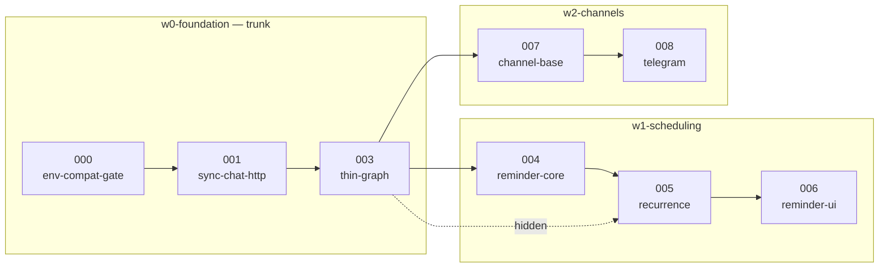
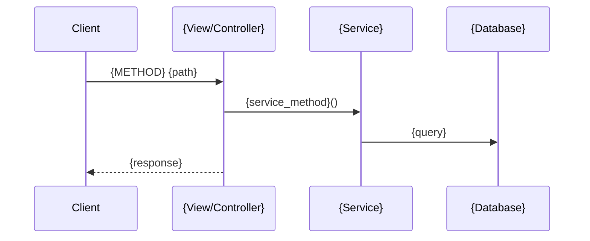

# Output Format Reference

## Directory Structure

```
<project-root>/
├── .speckit-prompts/
│   └── {prd-name}/
│       ├── DEPENDENCIES.md           # dependency DAG (Mermaid) + waves + hotspots
│       ├── PARALLEL_EXECUTION.md     # two-phase workmux runbook
│       ├── waves.json                # machine-readable wave plan (read by the scripts)
│       └── {NNN}-{kebab-case-name}/
│           ├── 01_specify.md
│           ├── 02_clarify.md
│           ├── 03_plan.md
│           ├── 04_checklist.md
│           ├── 05_tasks.md
│           ├── 06_analyze.md
│           ├── 07_implement.md
│           ├── 08_converge.md
│           └── 09_commit.md
├── utilities/
│   ├── speckit_pipeline.sh           # headless stage runner (phase/wave aware)
│   ├── speckit_parallel.sh           # workmux driver (2 phases, waves, sequential merge)
│   ├── wm_stage_runner.sh            # in-worktree pane script
│   └── wm_pre_merge_gate.sh          # pre_merge quality gate
└── .workmux.yaml                     # single-pane `speckit` layout + pre_merge hook
```

All four scripts are copied verbatim from the skill's `assets/` and `chmod +x`-ed. `.workmux.yaml` is rendered from `assets/workmux.yaml.template`.

## Folder Naming Convention

- Format: `{prd-name}/{NNN}-{kebab-case-name}` — all per-issue folders live under a single parent named after the PRD
- `{prd-name}`: short kebab-case project name derived from the PRD title/product name (2-4 words, strip generic words like "PRD"), e.g. PRD titled "일본어 학습 튜터 챗봇" → `japanese-tutor`
- `{NNN}`: source issue number zero-padded to 3 digits (`00` → `000`, `08` → `008`)
- `{kebab-case-name}`: issue filename slug with the number prefix removed
- Examples (issue file → folder, PRD → `japanese-tutor`):
  - `00-env-compat-gate.md` → `japanese-tutor/000-env-compat-gate/`
  - `01-sync-chat-http.md` → `japanese-tutor/001-sync-chat-http/`
  - `03-ws-streaming-thin-graph.md` → `japanese-tutor/003-ws-streaming-thin-graph/`

The folder name **is** the feature `id`. It must match `waves.json` entries, worktree branch suffixes (`spec/000-env-compat-gate`), and status file names exactly.

## Stage File Order

Filenames encode the sequential run order — `01 → 09`:

| # | File | Command | Kind | Phase |
|---|------|---------|------|-------|
| 1 | `01_specify.md` | `/speckit.specify` | per-feature content | 1 (spec) |
| 2 | `02_clarify.md` | `/speckit.clarify` | fixed auto-accept | 1 (spec) |
| 3 | `03_plan.md` | `/speckit.plan` | per-feature content | 2 (build) |
| 4 | `04_checklist.md` | `/speckit.checklist` | fixed auto-accept | 2 (build) |
| 5 | `05_tasks.md` | `/speckit.tasks` | fixed command-only | 2 (build) |
| 6 | `06_analyze.md` | `/speckit.analyze` | fixed auto-accept | 2 (build) |
| 7 | `07_implement.md` | `/speckit.implement` | per-feature rules | 2 (build) |
| 8 | `08_converge.md` | `/speckit.converge` | fixed auto-accept loop | 2 (build) |
| 9 | `09_commit.md` | `/sc:git commit` | fixed | end of each phase |

## waves.json Schema

Machine-readable output of the dependency analysis. `speckit_pipeline.sh --wave` and `speckit_parallel.sh` both read it.

A **wave is a vertical dependency chain**, not a depth level: its features run sequentially in one worktree, and waves run concurrently. A **stage** is a group of waves separated from the next group by a merge barrier.

```json
{
  "project": "japanese-tutor",
  "prd": "docs/prd-japanese-tutor.md",
  "issues_dir": "docs/issues",
  "schema": 2,
  "stages": [
    { "index": 0, "kind": "trunk",  "waves": ["w0-foundation"] },
    { "index": 1, "kind": "branch", "waves": ["w1-scheduling", "w2-channels", "w3-reporting"] }
  ],
  "waves": [
    {
      "name": "w0-foundation",
      "title": "Foundation",
      "kind": "trunk",
      "stage": 0,
      "rationale": "The serial spine — every branch wave needs the env gate, the HTTP surface, and the shared graph node.",
      "features": ["000-env-compat-gate", "001-sync-chat-http", "003-thin-graph"],
      "depends_on": []
    },
    {
      "name": "w1-scheduling",
      "title": "Scheduling chain",
      "kind": "branch",
      "stage": 1,
      "rationale": "Reminder scheduling end to end; touches no module the channel or reporting chains touch.",
      "features": ["004-reminder-core", "005-recurrence", "006-reminder-ui"],
      "depends_on": ["w0-foundation"]
    }
  ],
  "features": [
    {
      "id": "000-env-compat-gate",
      "number": "000",
      "slug": "env-compat-gate",
      "spec_dir": "specs/000-env-compat-gate",
      "wave": "w0-foundation",
      "declared_blocked_by": [],
      "hidden_blocked_by": [],
      "effective_blocked_by": []
    },
    {
      "id": "005-recurrence",
      "number": "005",
      "slug": "recurrence",
      "spec_dir": "specs/005-recurrence",
      "wave": "w1-scheduling",
      "declared_blocked_by": ["004-reminder-core"],
      "hidden_blocked_by": ["003-thin-graph"],
      "effective_blocked_by": ["004-reminder-core", "003-thin-graph"],
      "hidden_reason": "AC3 evaluates recurrence inside the graph node that 003 introduces."
    }
  ],
  "hotspots": [
    {
      "path": "config/settings/base.py",
      "touched_by": ["000-env-compat-gate", "004-reminder-core", "007-channel-base"],
      "owner": "000-env-compat-gate",
      "owner_wave": "w0-foundation",
      "rule": "w0 creates LOCAL_APPS with a stable tail; branch waves append only if absent."
    }
  ],
  "constitution_candidates": [
    "Timezone handling: store UTC, render in the user's tz",
    "Error envelope shape for all API failures"
  ]
}
```

Rules:

- `stages` is **ordered** — the driver runs stage 0, merges, runs stage 1, merges, and so on. A `trunk` stage holds exactly one wave; a `branch` stage holds two or more that run concurrently.
- `waves[].features` is **ordered** — it is the execution order inside the wave (topological), and the runner follows the array, not the folder numbering.
- Every `features[].id` appears in exactly one `waves[].features` list, and `features[].id` equals the prompt folder name **and** the `specs/` directory name.
- `effective_blocked_by` = union of declared and hidden. Every blocker must be either earlier in the same wave or in an earlier stage — **never in a sibling wave**. If a dependency would cross sibling waves, merge those waves into one.
- `hidden_reason` is required whenever `hidden_blocked_by` is non-empty.
- `spec_dir` is what the runner pins via `SPECIFY_FEATURE_DIRECTORY`; keep it `specs/{id}`.

Older `waves.json` files without `stages` still load: the driver groups by `waves[].stage`, or falls back to one wave per stage (fully sequential — safe but slow).

## DEPENDENCIES.md Template

```markdown
# {Project Title} — Dependency DAG and Wave Plan

Derived from `{prd path}` and `{issues dir}`. {N} features in {M} waves across {S} stages.

Waves are **vertical**: one wave is one dependency chain, run sequentially in its own worktree.
Waves inside a stage run concurrently; stages are separated by a merge barrier.

Phase 1 (`specify`+`clarify`) ignores waves entirely — it runs all {N} features at once in the
main working tree, because those stages never read the codebase.

## Dependency Graph

Edges are **effective** dependencies (declared + hidden). Each subgraph is one wave.


```mermaid
flowchart LR
    subgraph W0["w0-foundation — trunk"]
        direction LR
        F000["000<br/>env-compat-gate"] --> F001["001<br/>sync-chat-http"] --> F003["003<br/>thin-graph"]
    end
    subgraph W1["w1-scheduling"]
        direction LR
        F004["004<br/>reminder-core"] --> F005["005<br/>recurrence"] --> F006["006<br/>reminder-ui"]
    end
    subgraph W2["w2-channels"]
        direction LR
        F007["007<br/>channel-base"] --> F008["008<br/>telegram"]
    end

    F003 --> F004
    F003 --> F007
    F003 -.hidden.-> F005
```

> Dotted edges are **hidden** dependencies found in acceptance criteria, not declared in the issue.
> Every edge points either inside a wave or from an earlier stage — an edge between sibling waves
> means the partition is wrong and the two waves must be merged.

## Stages and Waves

| Stage | Kind | Wave | Title | Features (in run order) | Rationale |
|-------|------|------|-------|-------------------------|-----------|
| 0 | trunk | `w0-foundation` | Foundation | 000 → 001 → 003 | {the serial spine everything needs} |
| 1 | branch | `w1-scheduling` | Scheduling chain | 004 → 005 → 006 | {what it delivers, why independent} |
| 1 | branch | `w2-channels` | Delivery channels | 007 → 008 | {what it delivers, why independent} |

Stage 0 runs alone and merges into `main` automatically; stage 1's waves then run concurrently
from that updated `main`.

## Declared vs Effective Dependencies

| Feature | Declared | Hidden (from ACs) | Effective | Why hidden |
|---------|----------|-------------------|-----------|------------|
| 005-recurrence | 004 | 003 | 004, 003 | AC3 evaluates recurrence inside the graph node 003 introduces |

> A missed dependency is worse here than in a depth-based plan: it can place two features in
> sibling waves that cannot actually run concurrently.

## Shared Infrastructure Ownership

| File | Touched by | Owner | Owner wave | Idempotency rule |
|------|-----------|-------|-----------|------------------|
| `config/settings/base.py` | 000, 004, 007 | 000 | `w0-foundation` | w0 creates `LOCAL_APPS` with a stable tail; branch waves append only if absent |

A branch wave carries a whole chain of commits before it merges, so hotspot collisions all arrive
at the same barrier. Push ownership into the trunk, prefer per-feature files with auto-discovery
over one shared registry, and keep every remaining edit idempotent.

## Pin These in `constitution.md` Before Phase 1

`/speckit.clarify` runs concurrently per feature, and `/speckit.analyze` only checks a feature against
itself — two features can adopt contradicting conventions and both pass every gate.

- {convention 1 — e.g. timezone handling}
- {convention 2 — e.g. error envelope shape}
```

## PARALLEL_EXECUTION.md Template

```markdown
# {Project Title} — Parallel Execution Runbook

Two phases; {N} features, {M} waves, {S} stages. Wave plan: [DEPENDENCIES.md](DEPENDENCIES.md).

## Why the two phases look different

`/speckit.plan` is the first stage that reads and writes the codebase, so it is the boundary.
Before it, isolation is free; after it, isolation costs a worktree.

| Phase | Stages | Parallel unit | Isolation | Branch |
|-------|--------|---------------|-----------|--------|
| 1 — spec | `01_specify` → `02_clarify` | **the feature** — all {N} at once | none: one working tree, one env var per process | *(none — runs on `main`)* |
| 2 — build | `03_plan` → … → `08_converge` → commit | **the wave** — one dependency chain | one git worktree per wave | `build/{wave}` |

Phase 1 needs no worktrees because `specify`/`clarify` only write to `specs/{NNN}-{slug}/`, and each
process gets its own `SPECIFY_FEATURE_DIRECTORY`. It ends with a single commit, not {N} merges.

Phase 2 runs stage by stage. Stage 0 (the trunk) runs alone and auto-merges into `main`; the branch
waves then run concurrently off that `main` and merge sequentially at the end of their stage.

## Pre-flight (once)

```bash
brew install raine/workmux/workmux         # workmux + tmux required for Phase 2 only
git rm --cached .specify/feature.json 2>/dev/null; echo '.specify/feature.json' >> .gitignore
echo '.speckit-logs/' >> .gitignore
git commit -am "chore: prepare repo for parallel speckit"
chmod +x utilities/speckit_pipeline.sh utilities/speckit_parallel.sh \
         utilities/wm_stage_runner.sh utilities/wm_pre_merge_gate.sh
./utilities/speckit_parallel.sh waves       # confirm the stage/wave plan
```

Confirm `constitution.md` pins the cross-feature conventions listed in DEPENDENCIES.md **before** Phase 1.
Confirm `.workmux.yaml`'s `pre_merge` passes an explicit `env SPECKIT_VERIFY_CMD="..."` that is green
on the untouched baseline — unset, the gate falls back to the project's test command and reads any
non-zero exit as a merge failure, which blocks every wave.
If `.specify/extensions.yml` registers a `before_specify` hook (the git extension), disable it — it
creates a branch per `specify`, which collides with the single-working-tree fan-out.

## Phase 1 — spec (background fan-out, no worktrees)

```bash
./utilities/speckit_parallel.sh spec --dry-run
./utilities/speckit_parallel.sh spec                    # all {N} features at once
./utilities/speckit_parallel.sh spec --spec-jobs 6      # throttle if you hit 429s
```

Each feature gets its own background `claude -p` with `SPECIFY_FEATURE_DIRECTORY=specs/{id}`, writing
only inside its own spec directory. When they join, the driver runs the spec gate (every `spec.md`
exists, zero `[NEEDS CLARIFICATION]`) and makes **one** commit of `specs/`.

## Phase 2 — build, stage by stage

```bash
./utilities/speckit_parallel.sh build                    # every stage, in order
./utilities/speckit_parallel.sh build --stage 1          # one stage
./utilities/speckit_parallel.sh build --from-stage 1     # resume from a stage
./utilities/speckit_parallel.sh build --wave w2-channels # one wave
```

{Per-stage table: stage, kind, waves, features per wave, expected concurrency, what it unlocks}

## Monitoring

```bash
workmux dashboard
workmux list --json | jq -r '.[] | "\(.handle)\t\(.branch)"'
cat .speckit-logs/parallel/build/*.status              # RUNNING | OK | FAIL, one per wave
tail -f .speckit-logs/parallel/build/{wave}-logs/*/*.log
tail -f .speckit-logs/parallel/spec/{feature}.log      # Phase 1
```

Trust the status files and logs, not workmux's status icons — `claude -p` can go silent while thinking,
which workmux's 10-second no-output heuristic reads as "interrupted".

## Failure recovery

- **Phase 1**: a failed feature is reported and skipped; the others still commit. Re-run just it:
  `./utilities/speckit_pipeline.sh .speckit-prompts/{prd-name} --phase spec --only {NNN}`
- **Phase 2**: a wave whose status is `FAIL` is excluded from the merge and its worktree is preserved.
  The chain stops at the failing feature, so earlier features in that wave keep their commits.
  Fix inside the worktree and resume mid-chain:
  `./utilities/speckit_pipeline.sh .speckit-prompts/{prd-name} --phase build --from {NNN}`
- Merge again once fixed: `./utilities/speckit_parallel.sh merge --wave {wave}`
- A stage failure stops the run; nothing downstream starts on a broken barrier.

## Merge conflicts

A branch wave lands several features' commits at once, so hotspot conflicts arrive together.
`merge_strategy: merge` (not `rebase`) is deliberate — rebasing replays every commit in the chain
through the same conflict. Resolve in the worktree, then re-run `merge --wave {wave}`.

## Cost

Concurrent `claude -p` sessions multiply input tokens by the concurrency factor, and headless runs
bill against Agent SDK credits separately from the interactive pool. Phase 1 is short — run it wide.
Phase 2 waves are long — a mid-wave 429 is expensive, so keep `--max-concurrent` at 4..6.

## Cleanup

`merge_keep: true` preserves worktrees so a bad automated run leaves evidence. After review:

```bash
workmux list
workmux rm --all
```
```

## 01_specify.md Template

```markdown
/speckit.specify {Feature Name}: {one-line description}

## Purpose (Why)
{2-3 sentences}

## User Stories (prioritized, official spec-template format)

### US1 - {title} (Priority: P1)

{plain-language user journey}

**Independent Test**: {how this story is verified on its own}

**Acceptance Scenarios**:

1. **Given** {initial state}, **When** {action}, **Then** {expected outcome}

### US2 - {title} (Priority: P2)

{plain-language user journey}

**Independent Test**: {how this story is verified on its own}

**Acceptance Scenarios**:

1. **Given** {initial state}, **When** {action}, **Then** {expected outcome}

## User Workflow

{1-2 sentence explanation of the user workflow}

```mermaid
flowchart TD
    A[{user action}] --> B[{next step}]
    B --> C{"{decision}"}
    C -->|Yes| D[{success outcome}]
    C -->|No| E[{error handling}]
```

## Edge Cases

- What happens when {boundary condition}?
- How does the system handle {error scenario}?

## Functional Requirements

- **FR-001**: System MUST {specific capability}
- **FR-002**: System MUST {capability} [NEEDS CLARIFICATION: {open question}]

## Success Criteria

- **SC-001**: {measurable, technology-agnostic metric}

## Constraints
- {constraint}

## Out of Scope
- {exclusion}
```

> The runner pins the feature directory automatically (`SPECIFY_FEATURE_DIRECTORY=specs/{NNN}-{slug}`, exported and restated in the preamble) — do not write a number, a slug, or a `create-new-feature.sh` invocation into the prompt.

## 02_clarify.md Template

Fixed prompt — no per-feature customization.

```markdown
/speckit.clarify auto-accept all recommended options

Resolve spec ambiguities non-interactively before planning.
- Scan the spec across the official 10-category ambiguity taxonomy.
- Ask up to 5 clarification questions, one at a time.
- For each, automatically select the recommended/suggested option — do not pause for user input.
- Integrate the accepted answers into the spec's ## Clarifications section.
- If an ambiguity is a project-wide convention (timezone, error format, auth, logging), follow
  .specify/memory/constitution.md rather than inventing a feature-local answer.
```

## 03_plan.md Template

The `## Upstream Context` section is **mandatory** whenever the feature has effective blockers. With vertical waves the blocker's code is genuinely on disk when `plan` runs — merged from an earlier stage, or committed earlier in this same wave — so this section points at real files instead of substituting for absent ones.

```markdown
/speckit.plan

## Upstream Context (already implemented — read it, do NOT rebuild)

- **{NNN}-{slug}** (`{wave}`, merged into main): `{module path}::{symbol}` — {signature, contract, fields}
- **{NNN}-{slug}** (`{wave}`, earlier in this wave — already committed in this worktree):
  `{module path}::{symbol}` — {signature, contract, fields}

Read these files before planning; do not guess their shape. If one is genuinely absent, STOP and
report — it means the wave plan is wrong. Never create a replacement.

Tech Stack:
- {language + version}
- {framework + version}

Architecture:

{1-2 sentence explanation of the architecture}

```mermaid
graph TB
    subgraph "{Layer Name}"
        A[{Component}] --> B[{Component}]
    end
```

API Endpoints:
- `{METHOD} {path}` — {description}

API Sequence:

{1-2 sentence explanation of the API call flow}


```mermaid
sequenceDiagram
    participant C as Client
    participant V as {View/Controller}
    participant S as {Service}
    participant DB as {Database}
    C->>V: {METHOD} {path}
    V->>S: {service_method}()
    S->>DB: {query}
    V-->>C: {response}
```

Data Model:

{1-2 sentence explanation of the data model}

```mermaid
erDiagram
    {Entity1} ||--o{ {Entity2} : {relationship}
    {Entity1} {
        int id PK
        string name
    }
```

Existing Code Reference (brownfield — exact paths + signatures):
- {file path}: {function signature to modify / reuse}

Non-Functional Requirements:
- {quantified performance / security / deployment constraint}

Test Strategy:
- {framework + scope}

Explicit Exclusions:
- {exclusion — e.g. no Docker, no CI/CD}

Stop-guard: Generate plan.md ONLY. Do not create tasks or write implementation code in this step.
```

## 04_checklist.md Template

Fixed prompt — no per-feature customization.

```markdown
/speckit.checklist auto-accept all recommended options

Unit-test the requirements (the spec) for quality before task breakdown.
- Auto-select the recommended focus areas; run non-interactively.
- Validate completeness (every requirement has acceptance criteria), edge-case coverage
  (empty/zero/failure states defined), consistency (no contradicting requirements), and
  measurability (success criteria quantified).
- Tag findings [Completeness] / [Edge case] / [Consistency] / [Clarity].
- Auto-resolve fixable gaps by accepting the recommended resolution.
```

## 05_tasks.md Template

Fixed command-only prompt — **do NOT enumerate tasks here**. `/speckit.tasks` generates them from spec + plan.

```markdown
/speckit.tasks

Generate tasks.md automatically from spec.md + plan.md. Do NOT hand-author, enumerate, or
pre-write any T001-style tasks in this prompt — let the command derive them.
- Keep the official `[ID] [P?] [Story]` format with an exact file path in every task line.
- TDD tasks precede their implementation tasks; one task ≈ one commit.
- Do NOT manually edit tasks.md afterward. If tasks are wrong, fix plan.md and regenerate.
```

## 06_analyze.md Template

Fixed prompt — no per-feature customization.

```markdown
/speckit.analyze auto-accept all recommended options

Cross-check consistency and coverage across constitution ↔ spec ↔ plan ↔ tasks before implementation.
- Auto-accept the recommended resolution for each finding.
- CRITICAL: apply every fix at the correct layer. If a finding implies a task change, amend
  plan.md (or spec.md) and REGENERATE tasks via /speckit.tasks — never hand-edit tasks.md directly.
- Check: duplicate logic, uncovered requirements, hygiene (lint/security markers), and 4-way consistency.
- This runs before /speckit.implement so gaps are caught while plan/tasks are still adjustable.
```

## 07_implement.md Template

The `## Shared Infrastructure` section is **mandatory** whenever the feature touches a hotspot from `waves.json`. Sibling waves merge whole chains of commits at one barrier, so every non-owner edit must be additive and idempotent.

```markdown
/speckit.implement

## Shared Infrastructure (other waves touch these files too)

- `{path}` — owner: **{NNN}-{slug}** (`{owner wave}`). {Idempotent form of the edit, e.g. "append to
  LOCAL_APPS only if absent"; if this feature is not the owner, make only the additive change it needs
  and do not reorder or restructure the file — `{sibling wave}` edits it too and both merge into main.}

Implementation Rules:
- Implement all tasks in the task list in one pass (no partial slicing)
- Run tests after each task
- Stop on test failure
- Commit per task: "feat: [Task N] {description}"

Code Style:
- {formatter + rules}

Failure Handling:
- Test failure → stop and report
- Regression → rollback and report
- Design change needed → go back to /speckit.plan (do not redesign here)
```

## 08_converge.md Template

Fixed prompt — no per-feature customization.

```markdown
/speckit.converge auto-accept all recommended options

Verify all planned work is complete and close remaining gaps.
- Auto-accept recommended options.
- If /speckit.converge surfaces remaining gaps as new tasks, run /speckit.implement on them,
  then run /speckit.converge again.
- Repeat this converge → implement → converge loop until it reports "converged" (no new tasks).
- Verify with the project's build/test/lint gates each round; stop and report on failure.
- A task marked [X] that has no corresponding code or test is NOT complete — re-open it.
```

## 09_commit.md Template

```markdown
/sc:git commit
```

## Runner Scripts

Copy the skill's bundled assets verbatim and `chmod +x`. Do not regenerate them by hand.

| Asset | Destination |
|-------|-------------|
| `assets/speckit_pipeline.sh` | `utilities/speckit_pipeline.sh` |
| `assets/speckit_parallel.sh` | `utilities/speckit_parallel.sh` |
| `assets/wm_stage_runner.sh` | `utilities/wm_stage_runner.sh` |
| `assets/wm_pre_merge_gate.sh` | `utilities/wm_pre_merge_gate.sh` |
| `assets/workmux.yaml.template` | `.workmux.yaml` (render placeholders first) |

### `utilities/speckit_pipeline.sh` — headless stage runner

Iterates the `NNN-<slug>` feature folders under `.speckit-prompts/{prd-name}/` and runs each stage via `claude -p` (slash commands aren't supported headless, so it feeds each prompt file's contents as the instruction). It is the single source of stage/model/effort logic — the parallel driver delegates to it.

```bash
# Sequential, everything
./utilities/speckit_pipeline.sh .speckit-prompts/{prd-name}

# By phase
./utilities/speckit_pipeline.sh .speckit-prompts/{prd-name} --phase spec
./utilities/speckit_pipeline.sh .speckit-prompts/{prd-name} --phase build

# By wave (reads waves.json; runs the wave's features in array order, not folder order)
./utilities/speckit_pipeline.sh .speckit-prompts/{prd-name} --phase build --wave w1-scheduling

# Slices and recovery
./utilities/speckit_pipeline.sh .speckit-prompts/{prd-name} --only 002
./utilities/speckit_pipeline.sh .speckit-prompts/{prd-name} --from 003/06
./utilities/speckit_pipeline.sh .speckit-prompts/{prd-name} --dry-run
./utilities/speckit_pipeline.sh .speckit-prompts/{prd-name} --resume
```

| Phase | Stages | Commit scope |
|-------|--------|--------------|
| `spec` | `01_specify` → `02_clarify` | `specify+clarify` |
| `build` | `03_plan` → `04_checklist` → `05_tasks` → `06_analyze` → `07_implement` → `08_converge` | `implement` |
| `all` (default) | `01` → `08` | `implement` |

Env: `SPECKIT_LOG_ROOT` (log/checkpoint root), `SPECKIT_WORKTREE_MODE=1` (adds worktree isolation guardrails to the prompt preamble).

Every `claude -p` call runs unattended with `--permission-mode bypassPermissions --dangerously-skip-permissions` (no permission prompts, no first-run acceptance dialog). This refuses to run as root/sudo — run it as a normal user, ideally in an isolated environment (container/VM/dev container), since `bypassPermissions` offers no protection against prompt injection or unintended actions.

The runner **pins the feature directory** on every stage: it exports `SPECIFY_FEATURE_DIRECTORY=specs/{NNN}-{slug}` and `SPECIFY_FEATURE={NNN}-{slug}`, and restates both in the prompt preamble. Spec Kit 0.12+ reads that variable ahead of `.specify/feature.json`, which is what makes N concurrent `specify` runs in one working tree safe — without it every process scans `specs/` and computes the same `max+1`. The preamble also forbids branch creation and, for legacy Spec Kit (≤0.11), spells out `create-new-feature.sh --number NNN --short-name {slug} --allow-existing-branch`.

**Models are resolved at run start, never pinned to a version.** The runner asks "what is the newest Opus / Sonnet right now?" once, then holds that answer for the whole run:

1. `SPECKIT_OPUS_MODEL` / `SPECKIT_SONNET_MODEL` — explicit pin, for reproducible re-runs.
2. **Models API** (`GET /v1/models`) — newest `claude-opus-*` / `claude-sonnet-*` by `created_at`. Used only when `ANTHROPIC_API_KEY` is set; any failure falls through silently (5s timeout). Honors `ANTHROPIC_BASE_URL`.
3. **CLI alias** `opus` / `sonnet` — `claude --model` resolves an alias to the latest model itself, so this works with no API key.

Resolving **once** matters: passing the bare alias on every call would let a model released mid-run split a project across two models. One resolution per run keeps every feature on the same model and records which one in the log (`Models: opus -> … sonnet -> …`). Set `SPECKIT_SKIP_MODEL_RESOLVE=1` to skip the API lookup and use aliases only.

Per-stage defaults (override via env vars `SPECIFY_MODEL`/`SPECIFY_EFFORT`, `CLARIFY_*`, `PLAN_*`, `CHECKLIST_*`, `TASKS_*`, `ANALYZE_*`, `IMPLEMENT_*`, `CONVERGE_*` — a per-stage `*_MODEL` wins over the resolved family) — reasoning group = Opus (incl. converge), execution group = Sonnet. `MAX_TURNS` defaults to 2000 (override with `--max-turns`):

| Stage | Model | Effort | Max turns |
|-------|-------|--------|-----------|
| 01_specify | latest Opus | high | 30 |
| 02_clarify | latest Opus | high | 500 |
| 03_plan | latest Opus | xhigh | 2000 |
| 04_checklist | latest Opus | high | 500 |
| 05_tasks | latest Sonnet | xhigh | 2000 |
| 06_analyze | latest Opus | xhigh | 500 |
| 07_implement | latest Sonnet | xhigh | 2000 |
| 08_converge | latest Opus | xhigh | 2000 |
| commit | session default | — | 10 |

`xhigh` needs a recent Opus or Sonnet 5+; if resolution lands on an older model the API falls back to `high`.

Logs land in `$SPECKIT_LOG_ROOT/<timestamp>/`; a checkpoint file enables `--resume`.

### `utilities/speckit_parallel.sh` — two-phase driver

```bash
./utilities/speckit_parallel.sh waves                        # print the stage/wave plan
./utilities/speckit_parallel.sh spec [--dry-run]             # Phase 1 — background fan-out, no worktrees
./utilities/speckit_parallel.sh spec --spec-jobs 6           # throttle Phase 1
./utilities/speckit_parallel.sh build [--dry-run]            # Phase 2 — every stage in order
./utilities/speckit_parallel.sh build --stage 1
./utilities/speckit_parallel.sh build --from-stage 1
./utilities/speckit_parallel.sh build --wave w2-channels
./utilities/speckit_parallel.sh merge --wave w2-channels     # retry merges only
./utilities/speckit_parallel.sh merge --stage 1
```

Options: `--prompts <path>` (default: autodetect the single `.speckit-prompts/*/waves.json`), `--stage N`, `--from-stage N`, `--wave NAME`, `--max-concurrent N` (Phase 2, default 4), `--spec-jobs N` (Phase 1, default 0 = all features), `--base <branch>`, `--rebase`, `--no-merge`, `--no-commit`, `--dry-run`.

**Phase 1 (`spec`)** uses no workmux and no worktrees. It launches one background `claude -p` per feature in the main working tree, each with its own `SPECIFY_FEATURE_DIRECTORY`, and with `--no-commit` so no agent touches the git index. When they join it runs the spec gate and makes a single commit of `specs/`. Failed features are reported and skipped, not merged away.

**Phase 2 (`build`)** creates one worktree per **wave** via `workmux add --foreach "wave:…" --branch-template "build/{{ wave }}"` (workmux serializes worktree creation, avoiding `.git/worktrees/` races) and blocks on `--wait`. Success is reported through status files at `.speckit-logs/parallel/build/<wave>.status` because `--wait` does not propagate exit codes. Waves merge sequentially in `waves.json` order using the config's `merge_strategy` (`merge`; pass `--rebase` to override).

Pre-flight it enforces: an executable `speckit_pipeline.sh`, `.specify/feature.json` untracked, and a warning if `.specify/extensions.yml` registers a `before_specify` hook. Phase 2 additionally requires workmux + tmux, a `.workmux.yaml` with a `speckit` layout, an executable `wm_stage_runner.sh`, and a resolvable base branch.

### `utilities/wm_stage_runner.sh` — in-worktree pane script

Runs as the **single pane** of each wave's worktree window. Derives the wave from the branch name (tmux panes do not reliably inherit the driver's environment, so the branch is the channel), delegates to `speckit_pipeline.sh` with `SPECKIT_WORKTREE_MODE=1`, writes the status file into the **main** repo, and exits so the window closes and the driver advances.

```
build/{wave}   → --phase build --wave {wave}    (features run in waves.json order)
```

A `spec/…` branch is rejected with a pointer to `speckit_parallel.sh spec` — Phase 1 no longer uses worktrees.

### `utilities/wm_pre_merge_gate.sh` — quality gate

Two entry points: workmux's `pre_merge` hook (no arguments — reads `WM_BRANCH_NAME`), and a direct call from the driver after Phase 1.

```bash
bash utilities/wm_pre_merge_gate.sh                                    # pre_merge hook, build/{wave}
bash utilities/wm_pre_merge_gate.sh --phase spec --features "000-a 001-b"
bash utilities/wm_pre_merge_gate.sh --phase build --wave w1-scheduling
```

Because a wave holds several features, the gate iterates a **list**, not a single feature.

| Phase | Per-feature checks | Once per run |
|-------|--------------------|--------------|
| `spec` | `specs/{id}/spec.md` exists; zero `[NEEDS CLARIFICATION]` markers | — |
| `build` | `plan.md` + `tasks.md` exist; zero unchecked `- [ ] T…` tasks | project verify command passes |

A missing `specs/{id}/` is reported as a feature-directory pin failure, which is the signature of a numbering race.

Set `SPECKIT_VERIFY_CMD` to the project's test/lint command (auto-detects `uv run pytest -q` or `npm test`; `skip` disables). It runs once at the end of a build gate, not once per feature.

### `.workmux.yaml`

Rendered from `assets/workmux.yaml.template`. Phase 2 only — Phase 1 never touches workmux. The parts that are not negotiable:

- `layouts.speckit` with **exactly one pane** running `wm_stage_runner.sh`. `-W/--wait` and `--max-concurrent` only advance when the window closes, and a window closes only when every pane exits — a second pane (or an interactive `claude`) deadlocks the driver forever.
- The pane command **must end with `; exit`**. A pane `command:` is a line handed to a shell, so when the script finishes the shell returns to its prompt and the window never closes: the wave completes, writes `OK`, and the driver hangs anyway. This does not reproduce under `--dry-run` — only in a real run.
- `base_branch` set explicitly. Its default is the *current* branch, not `main`.
- `merge_strategy: merge`, **not** `rebase`. A wave carries a whole chain of commits; rebasing replays each one through the same hotspot conflict.
- `pre_merge` passes **an explicit `SPECKIT_VERIFY_CMD`, wrapped in `env`**. Left unset, the gate silently falls back to `uv run pytest -q` / `npm test` and treats any non-zero exit as a merge failure, so a repo with an existing non-zero baseline never merges a single wave. Wrapped as `VAR=... cmd` instead of `env VAR=... cmd`, the hook dies before the gate even runs if workmux exec's it without a shell. Both failures surface as the same "conflict or gate" message.
- `merge_keep: true` so a bad automated run leaves evidence behind.
- `pre_merge` wired to `wm_pre_merge_gate.sh`.
- Never `copy`/`symlink` a virtualenv (`.venv`, `node_modules`) — absolute paths inside make worktrees clobber each other. Recreate them in `post_create`.
```
