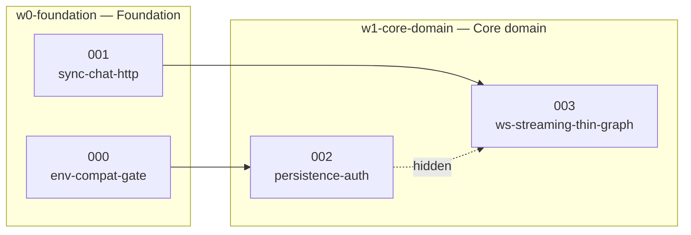
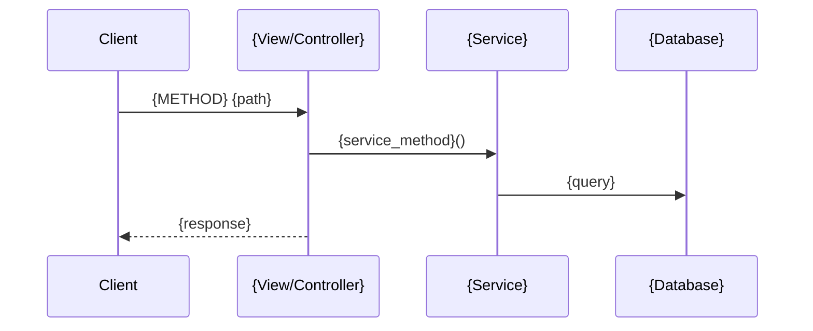

# Output Format Reference

## Directory Structure

```
<project-root>/
├── .speckit-prompts/
│   └── {prd-name}/
│       ├── DEPENDENCIES.md           # dependency DAG (Mermaid) + waves + hotspots
│       ├── PARALLEL_EXECUTION.md     # two-phase workmux runbook
│       ├── waves.json                # machine-readable wave plan (read by the scripts)
│       └── {NNN}-{kebab-case-name}/
│           ├── 01_specify.md
│           ├── 02_clarify.md
│           ├── 03_plan.md
│           ├── 04_checklist.md
│           ├── 05_tasks.md
│           ├── 06_analyze.md
│           ├── 07_implement.md
│           ├── 08_converge.md
│           └── 09_commit.md
├── utilities/
│   ├── speckit_pipeline.sh           # headless stage runner (phase/wave aware)
│   ├── speckit_parallel.sh           # workmux driver (2 phases, waves, sequential merge)
│   ├── wm_stage_runner.sh            # in-worktree pane script
│   └── wm_pre_merge_gate.sh          # pre_merge quality gate
└── .workmux.yaml                     # single-pane `speckit` layout + pre_merge hook
```

All four scripts are copied verbatim from the skill's `assets/` and `chmod +x`-ed. `.workmux.yaml` is rendered from `assets/workmux.yaml.template`.

## Folder Naming Convention

- Format: `{prd-name}/{NNN}-{kebab-case-name}` — all per-issue folders live under a single parent named after the PRD
- `{prd-name}`: short kebab-case project name derived from the PRD title/product name (2-4 words, strip generic words like "PRD"), e.g. PRD titled "일본어 학습 튜터 챗봇" → `japanese-tutor`
- `{NNN}`: source issue number zero-padded to 3 digits (`00` → `000`, `08` → `008`)
- `{kebab-case-name}`: issue filename slug with the number prefix removed
- Examples (issue file → folder, PRD → `japanese-tutor`):
  - `00-env-compat-gate.md` → `japanese-tutor/000-env-compat-gate/`
  - `01-sync-chat-http.md` → `japanese-tutor/001-sync-chat-http/`
  - `03-ws-streaming-thin-graph.md` → `japanese-tutor/003-ws-streaming-thin-graph/`

The folder name **is** the feature `id`. It must match `waves.json` entries, worktree branch suffixes (`spec/000-env-compat-gate`), and status file names exactly.

## Stage File Order

Filenames encode the sequential run order — `01 → 09`:

| # | File | Command | Kind | Phase |
|---|------|---------|------|-------|
| 1 | `01_specify.md` | `/speckit.specify` | per-feature content | 1 (spec) |
| 2 | `02_clarify.md` | `/speckit.clarify` | fixed auto-accept | 1 (spec) |
| 3 | `03_plan.md` | `/speckit.plan` | per-feature content | 2 (build) |
| 4 | `04_checklist.md` | `/speckit.checklist` | fixed auto-accept | 2 (build) |
| 5 | `05_tasks.md` | `/speckit.tasks` | fixed command-only | 2 (build) |
| 6 | `06_analyze.md` | `/speckit.analyze` | fixed auto-accept | 2 (build) |
| 7 | `07_implement.md` | `/speckit.implement` | per-feature rules | 2 (build) |
| 8 | `08_converge.md` | `/speckit.converge` | fixed auto-accept loop | 2 (build) |
| 9 | `09_commit.md` | `/sc:git commit` | fixed | end of each phase |

## waves.json Schema

Machine-readable output of the dependency analysis. `speckit_pipeline.sh --wave` and `speckit_parallel.sh` both read it.

```json
{
  "project": "japanese-tutor",
  "prd": "docs/prd-japanese-tutor.md",
  "issues_dir": "docs/issues",
  "waves": [
    {
      "name": "w0-foundation",
      "title": "Foundation",
      "rationale": "No blockers — environment gate and the shared command surface everything else builds on.",
      "features": ["000-env-compat-gate", "001-sync-chat-http"]
    },
    {
      "name": "w1-core-domain",
      "title": "Core domain",
      "rationale": "Needs the HTTP surface from w0; these three touch disjoint modules.",
      "features": ["002-persistence-auth", "003-ws-streaming-thin-graph"]
    }
  ],
  "features": [
    {
      "id": "000-env-compat-gate",
      "number": "000",
      "slug": "env-compat-gate",
      "wave": "w0-foundation",
      "declared_blocked_by": [],
      "hidden_blocked_by": [],
      "effective_blocked_by": []
    },
    {
      "id": "003-ws-streaming-thin-graph",
      "number": "003",
      "slug": "ws-streaming-thin-graph",
      "wave": "w1-core-domain",
      "declared_blocked_by": ["001-sync-chat-http"],
      "hidden_blocked_by": ["002-persistence-auth"],
      "effective_blocked_by": ["001-sync-chat-http", "002-persistence-auth"],
      "hidden_reason": "AC4 requires the streamed turn to be persisted, which only 002 provides."
    }
  ],
  "hotspots": [
    {
      "path": "config/settings/base.py",
      "touched_by": ["000-env-compat-gate", "002-persistence-auth"],
      "owner": "000-env-compat-gate",
      "rule": "Append to LOCAL_APPS idempotently — check membership before adding."
    }
  ],
  "constitution_candidates": [
    "Timezone handling: store UTC, render in the user's tz",
    "Error envelope shape for all API failures"
  ]
}
```

Rules:

- `waves` is **ordered** — the driver executes it top to bottom.
- Every `features[].id` appears in exactly one `waves[].features` list.
- `effective_blocked_by` = union of declared and hidden. Every blocker must sit in a strictly earlier wave.
- `hidden_reason` is required whenever `hidden_blocked_by` is non-empty.

## DEPENDENCIES.md Template

```markdown
# {Project Title} — Dependency DAG and Wave Plan

Derived from `{prd path}` and `{issues dir}`. {N} features in {M} waves.

Parallel safety boundary: `/speckit.plan`. Phase 1 (`specify`+`clarify`) runs every feature at once;
Phase 2 (`plan`…`converge`) runs one wave at a time with a merge barrier between waves.

## Dependency Graph

Edges are **effective** dependencies (declared + hidden). Each subgraph is one wave.


```mermaid
flowchart LR
    subgraph W0["w0-foundation — Foundation"]
        F000["000<br/>env-compat-gate"]
        F001["001<br/>sync-chat-http"]
    end
    subgraph W1["w1-core-domain — Core domain"]
        F002["002<br/>persistence-auth"]
        F003["003<br/>ws-streaming-thin-graph"]
    end

    F000 --> F002
    F001 --> F003
    F002 -.hidden.-> F003
```

> Dotted edges are **hidden** dependencies found in acceptance criteria, not declared in the issue.

## Waves

| Wave | Title | Features | Unlocked by | Rationale |
|------|-------|----------|-------------|-----------|
| `w0-foundation` | Foundation | 000, 001 | — | {why these can start immediately} |
| `w1-core-domain` | Core domain | 002, 003 | w0 | {what w0 provides that these need} |

## Declared vs Effective Dependencies

| Feature | Declared | Hidden (from ACs) | Effective | Why hidden |
|---------|----------|-------------------|-----------|------------|
| 003-ws-streaming-thin-graph | 001 | 002 | 001, 002 | AC4 requires the streamed turn to be persisted |

> Trusting the declared graph alone produces a `plan.md` that references code that does not exist.

## Shared Infrastructure Ownership

| File | Touched by | Owner | Idempotency rule |
|------|-----------|-------|------------------|
| `config/settings/base.py` | 000, 002 | 000 | Check membership before appending to `LOCAL_APPS` |

Idempotent edits plus **sequential merge** is what keeps these from colliding. Neither works alone.

## Pin These in `constitution.md` Before Phase 1

`/speckit.clarify` runs concurrently per feature, and `/speckit.analyze` only checks a feature against
itself — two features can adopt contradicting conventions and both pass every gate.

- {convention 1 — e.g. timezone handling}
- {convention 2 — e.g. error envelope shape}
```

## PARALLEL_EXECUTION.md Template

```markdown
# {Project Title} — Parallel Execution Runbook

Two phases, {M} waves, driven by `workmux` git worktrees. Wave plan: [DEPENDENCIES.md](DEPENDENCIES.md).

## Why two phases

`/speckit.plan` is the only stage that reads the codebase, so it is the boundary.

| Phase | Stages | Parallelism | Branch |
|-------|--------|-------------|--------|
| 1 — spec | `01_specify` → `02_clarify` → commit | **all {N} features at once** | `spec/{NNN}-{slug}` |
| 2 — build | `03_plan` → … → `08_converge` → commit | **one wave at a time** | `build/{wave}/{NNN}-{slug}` |

A merge barrier closes each group: Phase 1's barrier puts every sibling `spec.md` on `main`;
each Phase 2 wave barrier exposes that wave's `contracts/` and `data-model.md` to the next wave's plan.

## Pre-flight (once)

```bash
brew install raine/workmux/workmux         # workmux + tmux required
git rm --cached .specify/feature.json 2>/dev/null; echo '.specify/feature.json' >> .gitignore
echo '.speckit-logs/' >> .gitignore
git commit -am "chore: prepare repo for parallel speckit worktrees"
chmod +x utilities/speckit_pipeline.sh utilities/speckit_parallel.sh \
         utilities/wm_stage_runner.sh utilities/wm_pre_merge_gate.sh
./utilities/speckit_parallel.sh waves       # confirm the wave plan
```

Confirm `constitution.md` pins the cross-feature conventions listed in DEPENDENCIES.md **before** Phase 1.

## Phase 1 — spec

```bash
./utilities/speckit_parallel.sh spec --dry-run
./utilities/speckit_parallel.sh spec
```

Runs all {N} features concurrently (throttled by `--max-concurrent`, default 4), each producing
`spec.md` + `## Clarifications` and a commit, then merges them into `main` one at a time.

## Phase 2 — build, wave by wave

```bash
./utilities/speckit_parallel.sh build                        # every wave, in order
./utilities/speckit_parallel.sh build --wave w1-core-domain  # one wave
./utilities/speckit_parallel.sh build --from-wave w2-channels
```

{Per-wave table: wave name, features, expected concurrency, what it unlocks}

## Monitoring

```bash
workmux dashboard
workmux list --json | jq -r '.[] | "\(.handle)\t\(.branch)"'
tail -f .speckit-logs/parallel/build/{wave}/logs/*/*.log
cat .speckit-logs/parallel/build/{wave}/*.status     # RUNNING | OK | FAIL
```

Trust the status files and logs, not workmux's status icons — `claude -p` can go silent while thinking,
which workmux's 10-second no-output heuristic reads as "interrupted".

## Failure recovery

- A feature whose status is `FAIL` is excluded from the merge; its worktree is preserved.
- Re-run just that feature inside its worktree, or drop back to sequential:
  `./utilities/speckit_pipeline.sh .speckit-prompts/{prd-name} --phase build --only {NNN}`
- Merge again once fixed: `./utilities/speckit_parallel.sh merge build --wave {wave}`
- A wave failure stops the run; nothing downstream starts on a broken barrier.

## Cost

Concurrent `claude -p` sessions multiply input tokens by the concurrency factor, and headless runs
bill against Agent SDK credits separately from the interactive pool. Start at `--max-concurrent 4`.

## Cleanup

`merge_keep: true` preserves worktrees so a bad automated run leaves evidence. After review:

```bash
workmux list
workmux rm --all
```
```

## 01_specify.md Template

```markdown
/speckit.specify {Feature Name}: {one-line description}

## Purpose (Why)
{2-3 sentences}

## User Stories (prioritized, official spec-template format)

### US1 - {title} (Priority: P1)

{plain-language user journey}

**Independent Test**: {how this story is verified on its own}

**Acceptance Scenarios**:

1. **Given** {initial state}, **When** {action}, **Then** {expected outcome}

### US2 - {title} (Priority: P2)

{plain-language user journey}

**Independent Test**: {how this story is verified on its own}

**Acceptance Scenarios**:

1. **Given** {initial state}, **When** {action}, **Then** {expected outcome}

## User Workflow

{1-2 sentence explanation of the user workflow}

```mermaid
flowchart TD
    A[{user action}] --> B[{next step}]
    B --> C{"{decision}"}
    C -->|Yes| D[{success outcome}]
    C -->|No| E[{error handling}]
```

## Edge Cases

- What happens when {boundary condition}?
- How does the system handle {error scenario}?

## Functional Requirements

- **FR-001**: System MUST {specific capability}
- **FR-002**: System MUST {capability} [NEEDS CLARIFICATION: {open question}]

## Success Criteria

- **SC-001**: {measurable, technology-agnostic metric}

## Constraints
- {constraint}

## Out of Scope
- {exclusion}
```

> The runner injects the `--number {NNN}` pin into this stage automatically — do not write it into the prompt.

## 02_clarify.md Template

Fixed prompt — no per-feature customization.

```markdown
/speckit.clarify auto-accept all recommended options

Resolve spec ambiguities non-interactively before planning.
- Scan the spec across the official 10-category ambiguity taxonomy.
- Ask up to 5 clarification questions, one at a time.
- For each, automatically select the recommended/suggested option — do not pause for user input.
- Integrate the accepted answers into the spec's ## Clarifications section.
- If an ambiguity is a project-wide convention (timezone, error format, auth, logging), follow
  .specify/memory/constitution.md rather than inventing a feature-local answer.
```

## 03_plan.md Template

The `## Upstream Context` section is **mandatory** whenever the feature has effective blockers. A parallel `plan` cannot read the prior feature's code, so the prompt supplies what the code would have shown.

```markdown
/speckit.plan

## Upstream Context (already provided by prior issues — do NOT rebuild)

- **{NNN}-{slug}** (`{wave}`): `{module path}::{symbol}` — {what it provides: signature, contract, fields}
- **{NNN}-{slug}** (`{wave}`): `{endpoint or module}` — {contract}

Treat the above as existing. If a file appears to be missing, do NOT create a replacement — it belongs
to another feature and will be merged before this one runs.

Tech Stack:
- {language + version}
- {framework + version}

Architecture:

{1-2 sentence explanation of the architecture}

```mermaid
graph TB
    subgraph "{Layer Name}"
        A[{Component}] --> B[{Component}]
    end
```

API Endpoints:
- `{METHOD} {path}` — {description}

API Sequence:

{1-2 sentence explanation of the API call flow}


```mermaid
sequenceDiagram
    participant C as Client
    participant V as {View/Controller}
    participant S as {Service}
    participant DB as {Database}
    C->>V: {METHOD} {path}
    V->>S: {service_method}()
    S->>DB: {query}
    V-->>C: {response}
```

Data Model:

{1-2 sentence explanation of the data model}

```mermaid
erDiagram
    {Entity1} ||--o{ {Entity2} : {relationship}
    {Entity1} {
        int id PK
        string name
    }
```

Existing Code Reference (brownfield — exact paths + signatures):
- {file path}: {function signature to modify / reuse}

Non-Functional Requirements:
- {quantified performance / security / deployment constraint}

Test Strategy:
- {framework + scope}

Explicit Exclusions:
- {exclusion — e.g. no Docker, no CI/CD}

Stop-guard: Generate plan.md ONLY. Do not create tasks or write implementation code in this step.
```

## 04_checklist.md Template

Fixed prompt — no per-feature customization.

```markdown
/speckit.checklist auto-accept all recommended options

Unit-test the requirements (the spec) for quality before task breakdown.
- Auto-select the recommended focus areas; run non-interactively.
- Validate completeness (every requirement has acceptance criteria), edge-case coverage
  (empty/zero/failure states defined), consistency (no contradicting requirements), and
  measurability (success criteria quantified).
- Tag findings [Completeness] / [Edge case] / [Consistency] / [Clarity].
- Auto-resolve fixable gaps by accepting the recommended resolution.
```

## 05_tasks.md Template

Fixed command-only prompt — **do NOT enumerate tasks here**. `/speckit.tasks` generates them from spec + plan.

```markdown
/speckit.tasks

Generate tasks.md automatically from spec.md + plan.md. Do NOT hand-author, enumerate, or
pre-write any T001-style tasks in this prompt — let the command derive them.
- Keep the official `[ID] [P?] [Story]` format with an exact file path in every task line.
- TDD tasks precede their implementation tasks; one task ≈ one commit.
- Do NOT manually edit tasks.md afterward. If tasks are wrong, fix plan.md and regenerate.
```

## 06_analyze.md Template

Fixed prompt — no per-feature customization.

```markdown
/speckit.analyze auto-accept all recommended options

Cross-check consistency and coverage across constitution ↔ spec ↔ plan ↔ tasks before implementation.
- Auto-accept the recommended resolution for each finding.
- CRITICAL: apply every fix at the correct layer. If a finding implies a task change, amend
  plan.md (or spec.md) and REGENERATE tasks via /speckit.tasks — never hand-edit tasks.md directly.
- Check: duplicate logic, uncovered requirements, hygiene (lint/security markers), and 4-way consistency.
- This runs before /speckit.implement so gaps are caught while plan/tasks are still adjustable.
```

## 07_implement.md Template

The `## Shared Infrastructure` section is **mandatory** whenever the feature touches a hotspot from `waves.json`.

```markdown
/speckit.implement

## Shared Infrastructure (other features touch these files too)

- `{path}` — owner: **{NNN}-{slug}**. {Idempotent form of the edit, e.g. "check membership before
  appending to LOCAL_APPS"; if this feature is not the owner, only make the additive change it needs.}

Implementation Rules:
- Implement all tasks in the task list in one pass (no partial slicing)
- Run tests after each task
- Stop on test failure
- Commit per task: "feat: [Task N] {description}"

Code Style:
- {formatter + rules}

Failure Handling:
- Test failure → stop and report
- Regression → rollback and report
- Design change needed → go back to /speckit.plan (do not redesign here)
```

## 08_converge.md Template

Fixed prompt — no per-feature customization.

```markdown
/speckit.converge auto-accept all recommended options

Verify all planned work is complete and close remaining gaps.
- Auto-accept recommended options.
- If /speckit.converge surfaces remaining gaps as new tasks, run /speckit.implement on them,
  then run /speckit.converge again.
- Repeat this converge → implement → converge loop until it reports "converged" (no new tasks).
- Verify with the project's build/test/lint gates each round; stop and report on failure.
- A task marked [X] that has no corresponding code or test is NOT complete — re-open it.
```

## 09_commit.md Template

```markdown
/sc:git commit
```

## Runner Scripts

Copy the skill's bundled assets verbatim and `chmod +x`. Do not regenerate them by hand.

| Asset | Destination |
|-------|-------------|
| `assets/speckit_pipeline.sh` | `utilities/speckit_pipeline.sh` |
| `assets/speckit_parallel.sh` | `utilities/speckit_parallel.sh` |
| `assets/wm_stage_runner.sh` | `utilities/wm_stage_runner.sh` |
| `assets/wm_pre_merge_gate.sh` | `utilities/wm_pre_merge_gate.sh` |
| `assets/workmux.yaml.template` | `.workmux.yaml` (render placeholders first) |

### `utilities/speckit_pipeline.sh` — headless stage runner

Iterates the `NNN-<slug>` feature folders under `.speckit-prompts/{prd-name}/` and runs each stage via `claude -p` (slash commands aren't supported headless, so it feeds each prompt file's contents as the instruction). It is the single source of stage/model/effort logic — the parallel driver delegates to it.

```bash
# Sequential, everything
./utilities/speckit_pipeline.sh .speckit-prompts/{prd-name}

# By phase
./utilities/speckit_pipeline.sh .speckit-prompts/{prd-name} --phase spec
./utilities/speckit_pipeline.sh .speckit-prompts/{prd-name} --phase build

# By wave (reads waves.json)
./utilities/speckit_pipeline.sh .speckit-prompts/{prd-name} --phase build --wave w1-core-domain

# Slices and recovery
./utilities/speckit_pipeline.sh .speckit-prompts/{prd-name} --only 002
./utilities/speckit_pipeline.sh .speckit-prompts/{prd-name} --from 003/06
./utilities/speckit_pipeline.sh .speckit-prompts/{prd-name} --dry-run
./utilities/speckit_pipeline.sh .speckit-prompts/{prd-name} --resume
```

| Phase | Stages | Commit scope |
|-------|--------|--------------|
| `spec` | `01_specify` → `02_clarify` | `specify+clarify` |
| `build` | `03_plan` → `04_checklist` → `05_tasks` → `06_analyze` → `07_implement` → `08_converge` | `implement` |
| `all` (default) | `01` → `08` | `implement` |

Env: `SPECKIT_LOG_ROOT` (log/checkpoint root), `SPECKIT_WORKTREE_MODE=1` (adds worktree isolation guardrails to the prompt preamble).

Every `claude -p` call runs unattended with `--permission-mode bypassPermissions --dangerously-skip-permissions` (no permission prompts, no first-run acceptance dialog). This refuses to run as root/sudo — run it as a normal user, ideally in an isolated environment (container/VM/dev container), since `bypassPermissions` offers no protection against prompt injection or unintended actions.

The runner injects a **parallel-safety preamble** at `01_specify`, forcing `create-new-feature.sh --number NNN`. Without it, every parallel worktree branching from the same base gets the same feature number — and even sequential runs drift by `+1` from the prompt numbering.

Per-stage defaults (override via env vars `SPECIFY_MODEL`/`SPECIFY_EFFORT`, `CLARIFY_*`, `PLAN_*`, `CHECKLIST_*`, `TASKS_*`, `ANALYZE_*`, `IMPLEMENT_*`, `CONVERGE_*`) — reasoning group = Opus (incl. converge), execution group = Sonnet. `MAX_TURNS` defaults to 1000 (override with `--max-turns`):

| Stage | Model | Effort | Max turns |
|-------|-------|--------|-----------|
| 01_specify | `claude-opus-4-8` | high | 30 |
| 02_clarify | `claude-opus-4-8` | high | 50 |
| 03_plan | `claude-opus-4-8` | xhigh | 1000 |
| 04_checklist | `claude-opus-4-8` | high | 50 |
| 05_tasks | `claude-sonnet-5` | xhigh | 1000 |
| 06_analyze | `claude-opus-4-8` | xhigh | 50 |
| 07_implement | `claude-sonnet-5` | xhigh | 1000 |
| 08_converge | `claude-opus-4-8` | xhigh | 1000 |
| commit | session default | — | 10 |

Logs land in `$SPECKIT_LOG_ROOT/<timestamp>/`; a checkpoint file enables `--resume`.

### `utilities/speckit_parallel.sh` — workmux driver

```bash
./utilities/speckit_parallel.sh waves                          # print the wave plan
./utilities/speckit_parallel.sh spec [--dry-run]               # Phase 1 — all features in parallel
./utilities/speckit_parallel.sh build [--dry-run]              # Phase 2 — every wave in order
./utilities/speckit_parallel.sh build --wave w1-core-domain
./utilities/speckit_parallel.sh build --from-wave w2-channels
./utilities/speckit_parallel.sh merge spec                     # retry merges only
./utilities/speckit_parallel.sh merge build --wave w1-core-domain
```

Options: `--prompts <path>` (default: autodetect the single `.speckit-prompts/*/waves.json`), `--max-concurrent N` (default 4), `--base <branch>`, `--no-merge`, `--dry-run`.

It creates one worktree per feature via `workmux add --foreach` (workmux serializes worktree creation, avoiding `.git/worktrees/` races) and blocks on `--wait`. Success is reported through status files under `.speckit-logs/parallel/{spec|build/<wave>}/<feature>.status` because `--wait` does not propagate exit codes. Merges are always sequential with `--rebase`.

Pre-flight checks it enforces: workmux + tmux present, `.workmux.yaml` with a `speckit` layout, an executable `wm_stage_runner.sh`, `.specify/feature.json` untracked, and a resolvable base branch.

### `utilities/wm_stage_runner.sh` — in-worktree pane script

Runs as the **single pane** of each worktree's window. Derives phase/wave/feature from the branch name (tmux panes do not reliably inherit the driver's environment, so the branch is the channel), delegates to `speckit_pipeline.sh` with `SPECKIT_WORKTREE_MODE=1`, writes the status file into the **main** repo, and exits so the window closes and the driver advances.

```
spec/{NNN}-{slug}                 → --phase spec  --only {NNN}
build/{wave}/{NNN}-{slug}         → --phase build --only {NNN}
```

### `utilities/wm_pre_merge_gate.sh` — merge gate

Runs as workmux's `pre_merge` hook; a non-zero exit aborts that merge and preserves the worktree.

| Phase | Checks |
|-------|--------|
| `spec` | `specs/{NNN}-*/spec.md` exists; zero `[NEEDS CLARIFICATION]` markers remain |
| `build` | `plan.md` + `tasks.md` exist; zero unchecked `- [ ] T…` tasks; project verify command passes |

Set `SPECKIT_VERIFY_CMD` to the project's test/lint command (auto-detects `uv run pytest -q` or `npm test`; `skip` disables).

### `.workmux.yaml`

Rendered from `assets/workmux.yaml.template`. The parts that are not negotiable:

- `layouts.speckit` with **exactly one pane** running `wm_stage_runner.sh`. `-W/--wait` and `--max-concurrent` only advance when the window closes, and a window closes only when every pane exits — a second pane (or an interactive `claude`) deadlocks the driver forever.
- `base_branch` set explicitly. Its default is the *current* branch, not `main`.
- `merge_keep: true` so a bad automated run leaves evidence behind.
- `pre_merge` wired to `wm_pre_merge_gate.sh`.
- Never `copy`/`symlink` a virtualenv (`.venv`, `node_modules`) — absolute paths inside make worktrees clobber each other. Recreate them in `post_create`.
```
