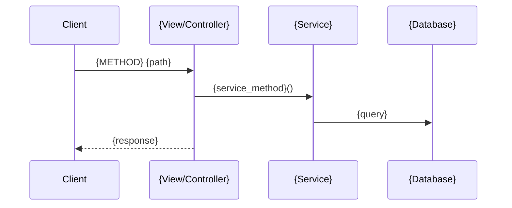

# Output Format Reference

## Directory Structure

```
<project-root>/
├── .speckit-prompts/
│   └── {prd-name}/
│       └── {NNN}-{kebab-case-name}/
│           ├── 01_specify.md
│           ├── 02_clarify.md
│           ├── 03_plan.md
│           ├── 04_tasks.md
│           ├── 05_implement.md
│           └── 06_commit.md
└── utilities/
    └── speckit_pipeline.sh   # headless runner (copied from the skill's assets/, chmod +x)
```

## Folder Naming Convention

- Format: `{prd-name}/{NNN}-{kebab-case-name}` — all per-issue folders live under a single parent named after the PRD
- `{prd-name}`: short kebab-case project name derived from the PRD title/product name (2-4 words, strip generic words like "PRD"), e.g. PRD titled "일본어 학습 튜터 챗봇" → `japanese-tutor`
- `{NNN}`: source issue number zero-padded to 3 digits (`00` → `000`, `08` → `008`)
- `{kebab-case-name}`: issue filename slug with the number prefix removed
- Examples (issue file → folder, PRD → `japanese-tutor`):
  - `00-env-compat-gate.md` → `japanese-tutor/000-env-compat-gate/`
  - `01-sync-chat-http.md` → `japanese-tutor/001-sync-chat-http/`
  - `03-ws-streaming-thin-graph.md` → `japanese-tutor/003-ws-streaming-thin-graph/`

## 01_specify.md Template

```markdown
/speckit.specify {Feature Name}: {one-line description}

## Purpose (Why)
{2-3 sentences}

## User Stories (prioritized, official spec-template format)

### US1 - {title} (Priority: P1)

{plain-language user journey}

**Independent Test**: {how this story is verified on its own}

**Acceptance Scenarios**:

1. **Given** {initial state}, **When** {action}, **Then** {expected outcome}

### US2 - {title} (Priority: P2)

{plain-language user journey}

**Independent Test**: {how this story is verified on its own}

**Acceptance Scenarios**:

1. **Given** {initial state}, **When** {action}, **Then** {expected outcome}

## User Workflow

{1-2 sentence explanation of the user workflow}

```mermaid
flowchart TD
    A[{user action}] --> B[{next step}]
    B --> C{"{decision}"}
    C -->|Yes| D[{success outcome}]
    C -->|No| E[{error handling}]
```

## Edge Cases

- What happens when {boundary condition}?
- How does the system handle {error scenario}?

## Functional Requirements

- **FR-001**: System MUST {specific capability}
- **FR-002**: System MUST {capability} [NEEDS CLARIFICATION: {open question}]

## Success Criteria

- **SC-001**: {measurable, technology-agnostic metric}

## Constraints
- {constraint}

## Out of Scope
- {exclusion}
```

## 02_clarify.md Template

```markdown
/speckit.clarify auto-accept all recommended options
```

## 03_plan.md Template

```markdown
/speckit.plan

Tech Stack:
- {language + version}
- {framework + version}

Architecture:

{1-2 sentence explanation of the architecture}

```mermaid
graph TB
    subgraph "{Layer Name}"
        A[{Component}] --> B[{Component}]
    end
```

API Endpoints:
- `{METHOD} {path}` — {description}

API Sequence:

{1-2 sentence explanation of the API call flow}


```mermaid
sequenceDiagram
    participant C as Client
    participant V as {View/Controller}
    participant S as {Service}
    participant DB as {Database}
    C->>V: {METHOD} {path}
    V->>S: {service_method}()
    S->>DB: {query}
    V-->>C: {response}
```

Data Model:

{1-2 sentence explanation of the data model}

```mermaid
erDiagram
    {Entity1} ||--o{ {Entity2} : {relationship}
    {Entity1} {
        int id PK
        string name
    }
```

Existing Code Reference:
- {file path}: {pattern}

Test Strategy:
- {framework + scope}

Explicit Exclusions:
- {exclusion}
```

## 04_tasks.md Template

```markdown
/speckit.tasks

Task Format (official): `[ID] [P?] [Story] Description with exact file path`
- Each task = 1 git commit
- [P] = parallelizable (different files, no dependencies)
- [USn] = user story label from the spec (US1, US2, ...)

Phase 1 (Setup):
  - [ ] T001 {description} in {file path}

Phase 2 (Foundational — blocks all user stories):
  - [ ] T002 {description} in {file path}
  - [ ] T003 [P] {description} in {file path}

Phase 3+ (one phase per user story, priority order):
  - [ ] T004 [P] [US1] {description} in {file path}
  - [ ] T005 [US1] {description} in {file path}

Dependencies:
- {dependency info}
```

## 05_implement.md Template

```markdown
/speckit.implement

Implementation Rules:
- Implement all tasks in the task list in one pass
- Run tests after each task
- Stop on test failure
- Commit per task: "feat: [Task N] {description}"

Code Style:
- {formatter + rules}

Failure Handling:
- Test failure → stop and report
- Regression → rollback and report
```

## 06_commit.md Template

```markdown
/sc:git commit
```

## Headless Runner (`utilities/speckit_pipeline.sh`)

Copy the skill's bundled `assets/speckit_pipeline.sh` verbatim to `<project-root>/utilities/speckit_pipeline.sh` and `chmod +x`. Do not regenerate it by hand — it is a fixed ~450-line script.

It iterates the `NNN-<slug>` feature folders under `.speckit-prompts/{prd-name}/` and runs each stage via `claude -p` (slash commands aren't supported headless, so it feeds each prompt file's contents as the instruction).

```bash
# Run every feature under the PRD folder
./utilities/speckit_pipeline.sh .speckit-prompts/{prd-name}

# One feature only / from a feature or stage / preview
./utilities/speckit_pipeline.sh .speckit-prompts/{prd-name} --only 002
./utilities/speckit_pipeline.sh .speckit-prompts/{prd-name} --from 003/04
./utilities/speckit_pipeline.sh .speckit-prompts/{prd-name} --dry-run
./utilities/speckit_pipeline.sh .speckit-prompts/{prd-name} --resume
```

Per-stage defaults (override via env vars `SPECIFY_MODEL`/`SPECIFY_EFFORT`, `CLARIFY_*`, `PLAN_*`, `TASKS_*`, `IMPLEMENT_*`):

| Stage | Model | Effort |
|-------|-------|--------|
| 01_specify / 02_clarify | `claude-opus-4-8` | high |
| 03_plan | `claude-opus-4-8` | xhigh |
| 04_tasks / 05_implement | `claude-sonnet-5` | xhigh |
| commit | session default | — |

Logs land in `.speckit-logs/<timestamp>/`; a checkpoint file enables `--resume`.
